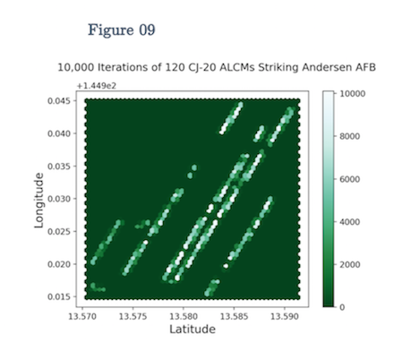

# gov90-monte-carlo

Files that model DF-26 s and CJ-20 ALCMs (each equipped with submunition warheads suited for attacking openly parked aircraft) sent to the USAF's Andersen AFB at Guam. Produced for course on conventional military analysis.

### Sample plots

