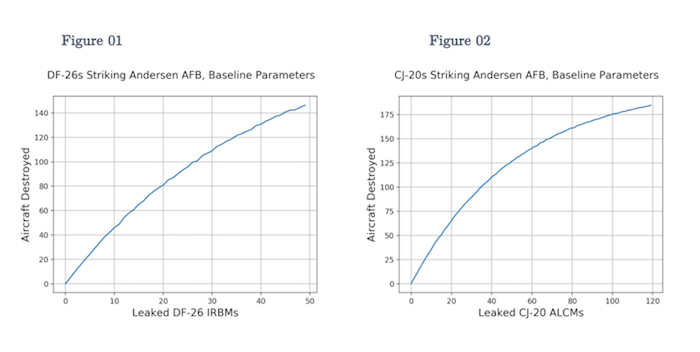
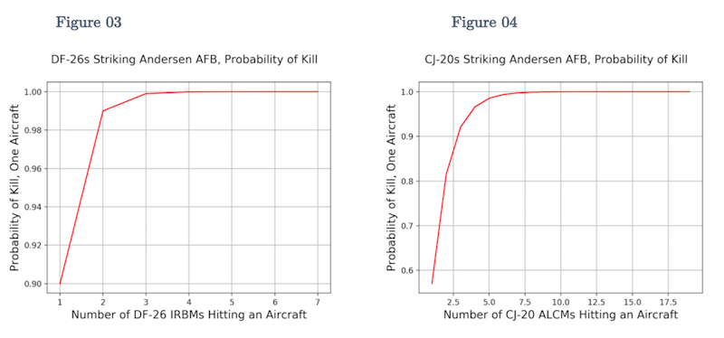
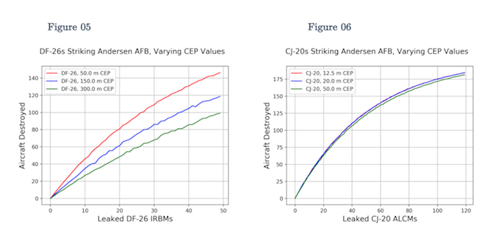
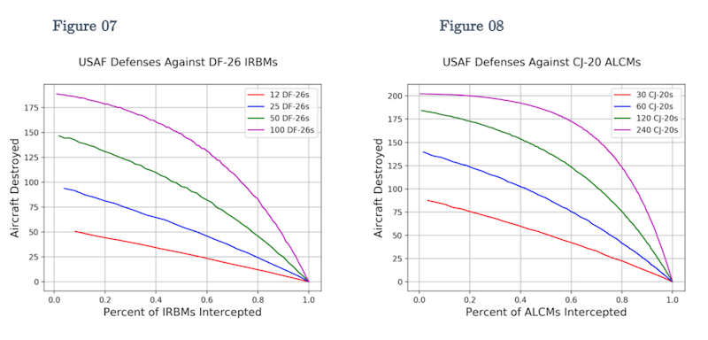
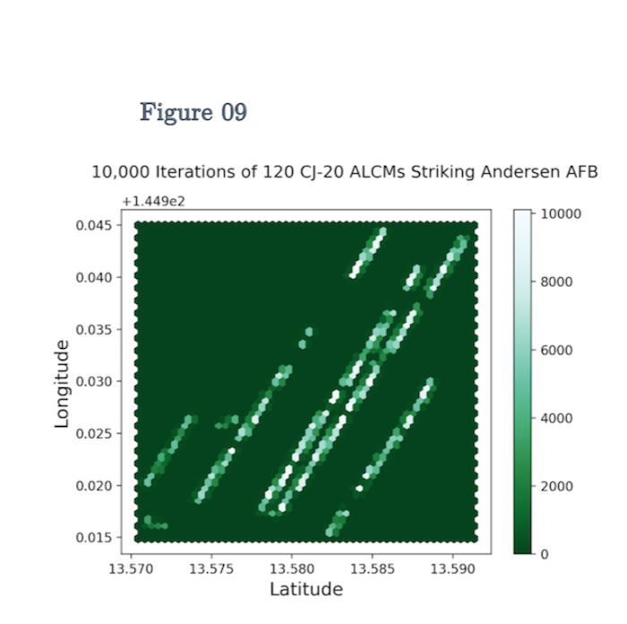

# gov90-monte-carlo

* Repository to model DF-26 IRBMs and CJ-20 ALCMs savlos directed toward USAF Andersen AFB at Guam.  
* Developed for final paper in course on conventional military analysis  
* GOV 90, Military Statecraft, London School of Economics, Michaelmas Term 2017

## About the repository

* `alcm/` and `irbm/` each contain:
	* `baseline/`: Baseline `.py` modelling files for missile
	* `plots/`: Pickled `.p` model results and `.py` plotting files
	* `runs/`: Non-baseline `.py` modeling files for missile
* `data/` contains:
	* Input airfield parking spot data (lat, lon coordinates)
* `sample_plots/` contains:
	* Plots used in paper (from `<alcm, irbm>/plots/`)
* `Andersen_AFB.pdf`: final paper submission (68 pp.)

## About the paper

This seminar paper models China's abilities to send missile salvos toward the USAF's Andersen AFB at Guam. As China has expanded its anti-access/area-denial (A2/AD) weapon systems inventory since 1990, the United States Pacific Command has been forced to operate from increasingly further distances from China's coastline. This has forced the USAF to operate from distant Pacific Ocean bases (primarily Andersen AFB at Guam, 3,000+ km away), and has degraded its ability to control the skies in battle, which is foundational to military success.

China's new conventional intermediate range ballistic missiles (IRBMs) and air launded cruise missiles (ALCMs) are game-changing components of the military balance between China and the United States. Analysts predict that the A2/AD IRBMs and ALCMs can: first, pin the the USAF's aircraft on the ground prior to battle; and second, destroy sufficiently large numbers of aircraft to win battles quickly. This has been a key piece of China's military doctrine since 1990, and its upgraded missile inventory provides the necessary capabilities.

Accordingly, the models in his repository determine outcomes of DF-26 IRBM and CJ-20 ALCM salvos sent toward Andersen AFB, measured by number of aircraft destroyed relative to number of missiles leaked. Plots below detail the outcomes, and more information on the paper is available upon request.

## About the models

The models in this repo are Monte Carlo variants that simulate large numbers of random salvos sent toward aircraft parked at Andersen AFB. Further details on the modeling process are included in the paper.

In short:
1. Each model simulates outcomes for 0 .. 120 missiles 'leaked'
2. Missiles are sent toward airfield parking spots with F-22 fighter aircraft
3. Missiles and subminitions fall around parking spots with normal distribution
4. Aircraft destruction is determined by subminition blast radius
5. Subminition destruction can 'overlap' allowing one missile to hit several aircraft

## Sample plots

