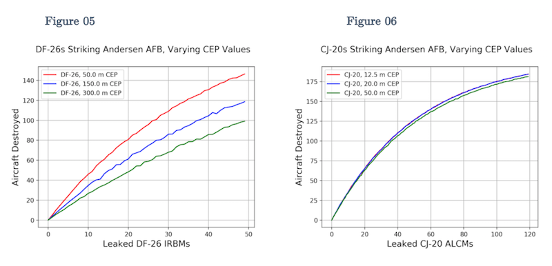

# gov90-monte-carlo

Repository to model DF-26 IRBMs and CJ-20 ALCMs savlos directed toward Andersen AFB at Guam.
Developed for course on conventional military analysis.

***

## About this repository

* `/alcm/` and `/irbm/` each contain
	* Test

***
## Sample plots

