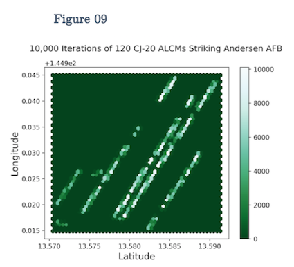

# gov90-monte-carlo

Repository to model DF-26 IRBMs and CJ-20 ALCMs savlos directed toward Andersen AFB at Guam.  
Developed for final paper in course on conventional military analysis  
GOV 85, Military Statecraft, London School of Economics, Michaelmas Term 2017

***

## About this repository

* `alcm/` and `irbm/` each contain:
	* `baseline/`: Baseline `.py` modelling files for missile
	* `plots/`: Pickled `.p` model results and `.py` plotting files
	* `runs/`: Non-baseline `.py` modelling files for missile
* `data/` contains:
	* Input airfield parking spot data (lat, lon coordinates)
* `sample_plots/` contains:
	* Plots used in paper (from `../<alcm, irbm>/plots/`)
* `Andersen_AFB.pdf`: paper

***
## Sample plots

